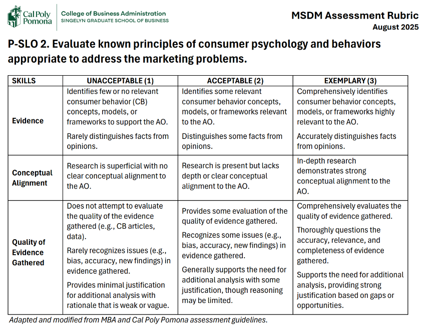
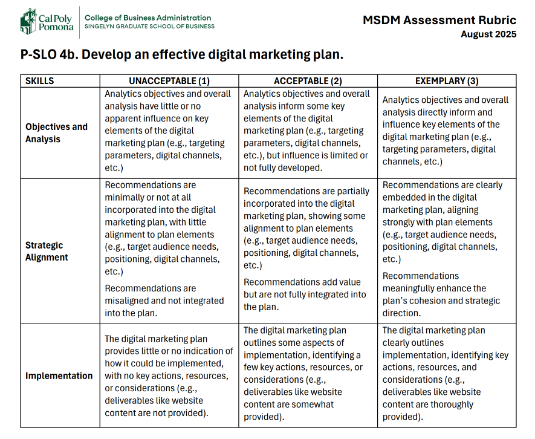

# TITLE PAGE {#sec-title-page .unnumbered}

------------------------------------------------------------------------

<br>



# SIGNATURE PAGE {#sec-signature-page .unnumbered}

------------------------------------------------------------------------

<br>



# ACKNOWLEDGMENTS PAGE {#sec-acknowledgments-page .unnumbered}

------------------------------------------------------------------------

<br>



# ABSTRACT {#sec-abstract .unnumbered}

# SUMMARY OF INDIVIDUAL CONTRIBUTION {#sec-summary-of-individual-contribution .unnumbered}

------------------------------------------------------------------------

<br>



# TABLE OF CONTENTS {#sec-table-of-contents .unnumbered}

# CHAPTER 1: INTRODUCTION {#sec-ch1-introduction}

Wellness Ranch Equine Assisted Therapy is a nonprofit organization that provides equine-assisted psychotherapy and wellness-focused services in Rancho Cucamonga, California [@wellnessranch2026]. This Culminating Experience Project focuses on strengthening the organization’s digital marketing foundation through improvements in search visibility, website performance, analytics, and paid search readiness. Building on recommendations developed by a Cal Poly Pomona search engine marketing class in Spring 2026, the project will move from identifying digital marketing opportunities to implementing, measuring, and evaluating selected strategies.

## Background and Problem Statement

Wellness Ranch Equine Assisted Therapy is a nonprofit based in Rancho Cucamonga, led by Director Angelica Manzo [@wellnessranch2026]. Founded in 2022 and established as a 501(c)(3) nonprofit organization in 2023, its mission is to "bring individual healing and empowerment to our clients through the transformative use of equine assisted therapy and community activities that promote mental wellness and learning" [@wellnessranchabout2026].

The ranch serves people of all ages, from children to adults, providing:

- Trauma-informed therapy
- Wellness education
- Community outreach

Services are offered to individuals, couples, and groups [@wellnessranchservices2026].

There is a real and growing need for what Wellness Ranch provides. The organization focuses mainly on the Inland Empire, especially underserved communities where access to responsive mental health care is affected by behavioral health workforce shortages [@hcai2025]. It is also building capacity in the field by training emerging mental health professionals through hands-on experience and internships.

In Spring 2026, a Cal Poly Pomona search engine marketing class researched Wellness Ranch's digital presence and produced recommendations across website, SEO, content, local search, and advertising. Our team picks up where that work left off.

Wellness Ranch has done tremendous and meaningful work, but its digital presence can improve and take it even further in connecting with the people who need help. There are three connected gaps:

1.  **Visibility.** When someone in the Inland Empire searches for trauma therapy, equine therapy, or mental health support, Wellness Ranch needs to show up. Right now, technical SEO issues, content and keyword gaps, and an underdeveloped local search presence make that harder.

2.  **Measurement.** Without a properly configured GA4 setup with defined events, conversions, and baseline KPIs, the organization can't tell which channels drive inquiries, sign-ups, or donations, so there's no way to know what's working.

3.  **Untapped resources.** As a nonprofit, Wellness Ranch may qualify for Google Ad Grants, which provides eligible nonprofit organizations with access to up to \$10,000 per month in Google Search advertising [@googleadgrants2026], but it hasn't yet applied or built the campaign structure to use it.

> **Core problem:** Wellness Ranch has a strong mission and growing community demand, but lacks the digital infrastructure to be found, measure its impact, and scale its reach.

Our project moves the organization from recommendations to implementation, measurement, and ongoing optimization so its online presence can support its mission instead of holding it back.

## Project Objectives (POs)

The overall purpose of this project is to help Wellness Ranch Equine Assisted Therapy convert earlier digital marketing recommendations into practical and sustainable improvements. Across the three-semester capstone project, the team will address the organization’s website, search visibility, analytics capabilities, advertising readiness, and long-term ability to manage its digital presence. The following five project objectives define the major outcomes expected from the project.

### PO1. Implement Priority Website and SEO Improvements

The first project objective is to review the recommendations produced by the Spring 2026 search engine marketing class and identify the improvements that are most relevant and feasible for Wellness Ranch. Using access to the Wix website, the team will evaluate and address priority technical SEO issues, broken links, page titles, keyword usage, internal linking, calls to action, landing pages, and other conversion-related elements.

The team will also examine local SEO opportunities that could help Wellness Ranch appear more consistently when Inland Empire residents search for equine-assisted therapy, trauma-informed services, mental-health support, and wellness resources. Website work will focus primarily on improving the organization, presentation, and optimization of existing information rather than creating an ongoing content-production program.

### PO2. Strengthen Analytics and Performance Measurement

The second project objective is to improve Wellness Ranch’s ability to measure the performance of its website and digital marketing activities. Although GA4 is already installed, the team must determine whether the current configuration captures the actions that are most meaningful to the organization.

This objective includes reviewing existing events and conversions, defining baseline key performance indicators, and determining how website activity relates to actions such as donation activity, contact-form submissions, calls, appointment inquiries, and program interest. Google Search Console and other available data sources may also be used to evaluate traffic, search visibility, engagement, and user behavior.

### PO3. Obtain and Activate Google Ad Grants

The third project objective is to guide Wellness Ranch through the Google Ad Grants process, including eligibility verification, application, campaign development, and launch. If the organization qualifies, the team will assist with submitting the application and launching compliant search campaigns. If approval is delayed or denied, the team will document the barriers and recommend corrective actions.

This objective includes improving website and landing-page readiness, validating conversion tracking, researching keywords and audiences, and establishing campaign ownership and management procedures. After launch, the team will review measures such as impressions, clicks, click-through rate, search terms, and conversions to improve performance. The project will also provide documentation and recommendations so Wellness Ranch can maintain the account after the capstone concludes.

### PO4. Measure the Impact of Implemented Strategies

The fourth project objective is to evaluate whether the selected website, SEO, analytics, and digital marketing improvements produce measurable changes. The team will compare pre-implementation baseline data with post-implementation results when sufficient data are available.

Potential measures include organic search impressions, rankings, website traffic, engagement, donation activity, inquiries, conversions, and advertising results if campaigns are launched. Because seasonality, external events, platform changes, and other factors may influence performance, the results will be interpreted carefully rather than automatically attributing every change to a single intervention.

### PO5. Develop a Sustainable Digital Marketing Strategy

The fifth project objective is to integrate findings from the website, SEO, analytics, local search, conversion, and paid-search analyses into a sustainable digital marketing strategy. The project will conclude with prioritized recommendations, reporting guidance, documented procedures, and a practical roadmap that Wellness Ranch can continue using after the capstone ends.

This objective emphasizes sustainability. Recommendations must be realistic given the organization’s staffing, expertise, time, financial resources, and approval processes. Together, the five project objectives are intended to create a digital foundation that helps Wellness Ranch become easier to find, understand its performance, increase donations and other meaningful actions, and expand its community reach.

## Analytics Objectives (AOs)

The analytics objectives define the specific investigations needed to support the broader project objectives. Each analytics objective is assigned to one team member, but the findings will be shared and integrated across the project.

### AO1. On-Page and Off-Page SEO Performance Analysis (Alexa)

Analyze current SEO data, including technical issues, website content, backlinks, local SEO, and information from the SEO Fix Tracker and backlink audit, to identify which factors most affect Wellness Ranch Therapy’s search visibility and which pages and improvements should be prioritized.

AO1 directly supports PO1 by providing the evidence needed to select and prioritize website and SEO improvements. It also supports PO4 by identifying the SEO indicators that should be monitored before and after implementation. The resulting findings will contribute to the SEO component of the sustainable strategy developed under PO5.

### AO2. Conversion and Engagement Measurement (Kevin)

Analyze GA4 and Google Search Console data to establish baseline key performance indicators and evaluate which traffic sources, website interactions, and conversion actions represent meaningful engagement for Wellness Ranch Therapy.

AO2 directly supports PO2 by defining meaningful events, conversions, and performance measures. It also provides the baseline and post-implementation measures required for PO4. Its findings will help the team determine how Wellness Ranch should monitor future website and marketing performance under PO5.

### AO3. Evaluate Google Ad Grants Readiness and Campaign Data to Guide Application, Launch, and Optimization (Brian)

Evaluate Wellness Ranch Therapy’s eligibility, website and analytics readiness, organizational capacity, and campaign data to support the Google Ad Grants application, launch compliant campaigns, and guide ongoing optimization using measures such as click-through rate, search terms, conversions, and conversion rate.

AO3 directly supports PO3 by moving the organization from eligibility assessment through application, launch, measurement, and improvement. It also supports PO1 by identifying necessary website and landing-page improvements and PO2 by defining the conversion tracking required to evaluate campaign performance. The findings will contribute to the sustainable digital marketing roadmap developed under PO5.

### AO4. Analyze Google Ad Grants Campaign Data to Improve Click-Through and Conversion Rates (Ron)

### AO4. Analyze Google Ad Grants Campaign Data to Improve Click-Through and Conversion Rates (Ron)

Once Wellness Ranch's Google Ad Grants campaigns launch, I will analyze Google Ads and GA4 data to identify which keywords, ads, and landing pages drive meaningful results. Key metrics include impressions, clicks, click-through rate (CTR), search terms, conversions, and conversion rate. CTR is especially important because Ad Grants accounts must maintain at least a 5% CTR to stay compliant.

To achieve this, I will review search terms to add negative keywords, compare keyword and ad group performance, test ad copy and calls to action, and evaluate which landing pages turn visitors into inquiries, calls, or donations. Findings will be summarized in regular performance reports with optimization recommendations.

AO4 directly supports PO3 by optimizing campaigns after launch, while AO3 covers eligibility, application, and launch. It also supports PO2 by relying on the website's conversion tracking.

## Alignment Between Project Objectives and Analytics Objectives

The project objectives describe what the team intends to accomplish for Wellness Ranch, while the analytics objectives define the analysis and evidence needed to make those decisions. The relationship between the POs and AOs is summarized below.

| Project Objective | Directly Supporting AO | Additional Supporting AOs | Relationship |
|---|---|---|---|
| PO1. Implement priority website and SEO improvements | AO1 | AO2, AO3, and AO4 | AO1 identifies the SEO and website factors that should be prioritized. AO2 identifies conversion and measurement needs, AO3 identifies website and landing-page requirements for Google Ad Grants campaigns, and AO4 measures the effects of the changes. |
| PO2. Strengthen analytics and performance measurement | AO2 | AO3 and AO4 | AO2 establishes KPIs, events, conversions, and baseline measures. AO3 evaluates whether the measurement infrastructure can support Google Ads and uses campaign metrics to guide optimization, while AO4 applies the measures to evaluate results. |
| PO3. Obtain and activate Google Ad Grants | AO3 | AO1 and AO2 | AO3 evaluates eligibility and readiness, supports the application and campaign launch, and analyzes campaign data to guide compliant management and optimization. AO1 supports website and landing-page readiness, while AO2 supports conversion measurement. |
| PO4. Measure the impact of implemented strategies | AO4 | AO1, AO2, and AO3 | AO4 compares baseline and post-implementation results. AO3 contributes Google Ads measures such as clicks, click-through rate, search terms, and conversions, while the other interventions and measures originate from the preceding AOs. |
| PO5. Develop a sustainable digital marketing strategy | AO1, AO2, AO3, and AO4 collectively | All AOs | PO5 integrates the findings of all four analyses into recommendations, procedures, reporting guidance, and a long-term roadmap. |

### Coverage of the Project Objectives

The project objectives are converted into analytics work through four assigned AOs. PO1 through PO4 each have a directly corresponding analytics objective:

- PO1 is primarily supported by AO1.
- PO2 is primarily supported by AO2.
- PO3 is primarily supported by AO3.
- PO4 is primarily supported by AO4.

PO5 does not have a separate one-to-one analytics objective. However, this does not represent an unsupported project objective. PO5 is an integration and implementation objective rather than a separate analytical question. It can be achieved by combining the findings from AO1 through AO4 into a sustainable digital marketing strategy.

Creating another AO solely for PO5 would duplicate work already performed through the four existing analyses. Instead, the team will use the evidence produced by all four AOs to develop the final recommendations, reporting procedures, and client roadmap. Therefore, all five POs are supported by analytics work even though the project contains four AOs.

### Team Assignment and Individual Responsibility

Each member of the four-person project team has at least one analytics objective assigned:

| Team Member | Assigned Analytics Objective | Primary Area of Responsibility |
|---|---|---|
| Alexa | AO1 | SEO and website-priority analysis |
| Kevin | AO2 | GA4, Search Console, conversions, and baseline measurement |
| Brian | AO3 | Google Ad Grants readiness, application, campaign launch, and performance analysis |
| Ron | AO4 | Measurement of implemented digital marketing changes |

The assignments provide individual ownership while maintaining the connections among the analyses. For example, AO4 depends on the baseline established through AO2, while AO3 may identify website and landing-page improvements related to AO1 and conversion-tracking requirements related to AO2. Team members must therefore coordinate their findings rather than treating each AO as an independent project.

### Relevance of the Analytics Objectives

All four analytics objectives support at least one project objective, and none requires resources without contributing to the overall project. AO1 supports website and search visibility improvements, AO2 supports performance measurement, AO3 supports the Google Ad Grants application, campaign launch, measurement, and optimization, and AO4 supports impact evaluation. All four also contribute to PO5 by providing the evidence needed to develop a sustainable digital marketing strategy.

The relationship among the objectives follows a logical sequence:

1. AO1 identifies which website and SEO issues should be addressed.
2. AO2 establishes how website activity and meaningful outcomes will be measured.
3. AO3 evaluates Google Ad Grants readiness, supports the application and campaign launch, and analyzes campaign data to guide optimization.
4. AO4 evaluates the results of implemented changes.
5. Findings from all four AOs are integrated to accomplish PO5 and produce the final strategic roadmap.

This alignment ensures that the team’s analytical work is connected to the client’s needs and that each AO contributes to a defined project outcome.

## Significance of the Project

This project is significant because Wellness Ranch Equine Assisted Therapy operates in an area where digital visibility can directly support access to mental wellness services and community resources. As a nonprofit serving children, adults, couples, and groups throughout the Inland Empire, Wellness Ranch relies on its ability to communicate its services to individuals who may be actively searching for therapy, equine-assisted services, wellness education, and related support. Improving the organization’s digital presence can make it easier for these audiences to find relevant information and take the next step toward engaging with the organization.

The project is also significant because it addresses the connection between digital marketing activities and measurable organizational outcomes. Improving website content, SEO, local search visibility, and conversion pathways can increase opportunities for users to discover and engage with Wellness Ranch. However, these improvements are most useful when their impact can be measured. Establishing reliable GA4 events, conversions, and baseline KPIs will give the organization a clearer understanding of how users find the website, how they interact with it, and which actions may contribute to inquiries, program interest, or other meaningful outcomes.

For a nonprofit organization, the ability to use available resources efficiently is particularly important. The evaluation of Google Ad Grants provides Wellness Ranch with an opportunity to determine whether donated search advertising could support its outreach efforts without requiring the same level of financial investment as traditional paid advertising. Assessing eligibility, campaign readiness, and the organization's capacity to maintain the program will help ensure that any future advertising efforts are realistic and sustainable.

The project also builds on the work completed by the Spring 2026 search engine marketing class. Rather than developing recommendations independently, the current project provides an opportunity to move from identifying digital marketing opportunities to implementing, measuring, and evaluating selected improvements. This creates continuity between the two semesters while allowing the team to establish performance baselines and assess changes over time.

From an academic perspective, the project provides an applied opportunity to use digital marketing and analytics concepts in a real nonprofit setting. SEO analysis, website optimization, GA4 measurement, local search, and paid search planning will be evaluated based on both their potential impact and Wellness Ranch's ability to maintain them with its available resources. The project therefore demonstrates how data-informed digital marketing strategies can be adapted to the needs and constraints of a community-based organization.

Ultimately, the significance of this project is its potential to strengthen the connection between Wellness Ranch's mission and its digital presence. By improving how the organization is found, how user engagement is measured, and how digital marketing resources are managed, the project aims to provide Wellness Ranch with a sustainable foundation for reaching its target audiences and supporting its continued growth.

------------------------------------------------------------------------



# CHAPTER 2: BACKGROUND AND ANALYTICS OBJECTIVES {#sec-ch2-background-and-analytics-objectives}

## Client (Company) Background

Wellness Ranch Equine Assisted Therapy is a nonprofit organization based in Rancho Cucamonga, California. Founded in 2023 and led by Director Angelica Manzo, the organization uses equine-assisted therapy and community-based activities to promote mental wellness, personal development, and healing. Wellness Ranch serves children and adults through individual, couples, and group services. Its principal service area is the Inland Empire, including communities where access to mental-health care may be limited by cost, provider shortages, and other barriers.

The organization’s services include trauma-informed therapy, wellness education, and community outreach. Wellness Ranch also contributes to the development of future mental-health professionals by offering internships and hands-on learning opportunities. As a relatively new nonprofit, the organization is continuing to develop its operational capacity, public visibility, fundraising efforts, and digital infrastructure.

### Company Mission and Vision

Wellness Ranch’s stated mission is to *“bring individual healing and empowerment to our clients through the transformative use of equine assisted therapy and community activities that promote mental wellness and learning.”* This mission emphasizes healing, empowerment, education, and community engagement through interaction with horses and trained mental-health professionals.

A separate formal vision statement has not yet been provided to the project team. Based on the organization’s mission and current activities, its working vision appears to be the creation of a community in which people of different ages and backgrounds can access supportive, experiential, and affordable mental-health services. This interpretation should be confirmed with the client before it is presented as the organization’s official vision.

### Core Competencies

Wellness Ranch’s primary competency is providing equine-assisted, trauma-informed therapeutic experiences. The organization combines mental-health practices with structured interaction involving horses to offer an experiential form of support that differs from a traditional office-based setting.

Its core competencies include:

- Delivering equine-assisted therapy to individuals, couples, and groups

- Providing trauma-informed care for children and adults

- Creating experiential activities that support healing, learning, and empowerment

- Offering mental-wellness education and community outreach

- Serving communities in the Inland Empire

- Supporting access to care through insurance and sliding-scale services

- Providing internships and practical learning opportunities for emerging mental-health professionals

- Developing relationships among clients, professionals, volunteers, donors, and community partners

These competencies position Wellness Ranch as both a mental-health service provider and a community-based educational organization.

### Value Propositions

Wellness Ranch offers a distinctive combination of equine-assisted therapy, trauma-informed care, wellness education, and community engagement. Its value comes from providing clients with an experiential therapeutic environment that may appeal to individuals who are seeking an alternative or supplement to conventional therapy.

The organization’s major value propositions include:

- **Experiential care:** Clients participate in structured therapeutic experiences involving horses rather than relying exclusively on a traditional office setting.

- **Accessible services:** Insurance and sliding-scale options may help reduce financial barriers to mental-health care.

- **Services for different needs:** Programs are available to children and adults and may be delivered to individuals, couples, or groups.

- **Local community focus:** Wellness Ranch concentrates on the Inland Empire, including communities with limited access to responsive mental-health services.

- **Community and workforce development:** Outreach, education, internships, and hands-on training extend the organization’s impact beyond direct client services.

- **Mission-driven use of donations:** Financial contributions help the organization offset service costs, expand accessibility, and support individuals and families who may otherwise have difficulty obtaining care.

### Business Objectives

Wellness Ranch’s broader business objective is to expand its ability to serve individuals and families while maintaining accessible and mission-aligned services. Achieving this objective requires the organization to improve its visibility, fundraising capacity, digital measurement, and internal ability to manage digital-marketing activities.

The current business objectives include:

1.  **Increase digital visibility.** Improve the organization’s ability to appear when people search for equine-assisted therapy, trauma-informed care, mental-health support, and related services in the Inland Empire.

2.  **Strengthen the website.** Improve the homepage and other important pages so visitors can quickly understand the organization’s mission, services, impact, and available actions.

3.  **Communicate measurable impact.** Present verified information—such as clients served, programs delivered, or other substantiated outcomes—in a clear and responsible manner.

4.  **Increase donations.** Make donations more visible and reduce obstacles in the donation journey. The client has identified donations as the organization’s current primary website outcome.

5.  **Improve digital measurement.** Evaluate the existing GA4 implementation, define meaningful events and conversions, establish baseline key performance indicators, and determine which channels contribute to donations and inquiries.

6.  **Evaluate Google Ad Grants readiness.** Determine whether Wellness Ranch meets the eligibility requirements and possesses the website, analytics, staffing, and campaign-management capacity needed to apply for and sustain Google Ad Grants.

7.  **Build sustainable internal capacity.** Establish procedures, documentation, and ownership so that the website, analytics tools, and future advertising campaigns can continue to be managed after the capstone project concludes.

Together, these objectives support the organization’s larger mission by helping Wellness Ranch become easier to find, better able to demonstrate its impact, and more capable of generating the financial and community support needed to expand access to care.

## Description of the Client’s Current Marketing Program

### Marketing Team and Expertise

### Current Target Market

### Current Positioning and Perceptual Map

*Current Perceptual Map*

### Current Product/Services

### Current Pricing

### Current Marketing Channels

### Current Integrated Marketing Communications

## Description of the Company’s Current Digital Marketing Practices

### Brand Persona

### Digital Marketing Channels/Medium

#### Website and Landing Page

#### Keyword Research and SEO

#### Email Marketing

#### Social Media Posting

#### Paid Search Advertising

#### Social Media Advertising

#### Display advertising

### Other digital marketing channels & tactics

#### Conversion Rate Optimization (CRO)

#### Mobile Application

#### Affiliate Marketing

#### Influencer Campaigns

### Allocation of Resources to Customer-Influence Efforts

#### Demand Generation

#### Demand Harvesting

#### Loyalty Building

### Analytics Infrastructure

## Competitive Analysis

### Industry Size

#### Number of Companies

#### Number of Employees

#### Annual Revenue and Key Financial Information

#### Existence of Dominant Players and Competitors

#### Market Share of Each Major Player

### Industry Outlook

#### Industry Life Cycle

#### Future Sales/Profit Growth Outlook

### Key Competitors and Their Digital Marketing Strategies

#### Target Market

#### Positioning

#### Website and Landing Page

#### Keyword research and SEO

#### Email Marketing Strategy

#### Social Media Posting

#### Paid Search Advertising

#### Social Media Advertising

#### Display Advertising

#### Conversion Rate Optimization (CRO)

#### Mobile Application

#### Affiliate Marketing

#### Influencer Campaigns

#### Summary Table of Comparison

## Customer Analysis

### Segments and Their Brief Justification

#### Segment Name A

#### Segment Name B

#### Segment Name C

#### Segment Name D

#### **Summary Table of Segments**

### Segment Analysis

#### **Summary Table of Segment Evaluation**

## SWOT Analysis

### Strengths

### Weaknesses

### Opportunities

### Threats

### **Summary: SWOT quadrants**

## Investigation of Currently Available Research Framework/Model {#sec-investigation-of-currently-available-research-frameworkmodel}

::: callout-note
*The main purpose of this section is to gain understanding of the existing research on the topic of your project and assess if you can avoid doing redundant research that can address your analytics objectives. If indeed, there is sufficient existing research that can answer your analytics objectives, why can't you just use the knowledge? Thus, this section is crucial for establishing a solid foundation for your research. To this end, you will be answering the four sections below by filling out the four sections. Make sure you understand what is required for each section.*

1.  **Existence of Well-established Models** (2-3 pages per AO)

- Identify well-established consumer behavior theory/models/frameworks or analytical approaches relevant to the AO.

- Describe how the theory/models support the AO conceptual development in the context of solving the problem.

2.  **Adequateness of Gathered Information** (a paragraph per AO)

- Assess whether the gathered information (above) is sufficient in addressing the AO and thus solving the business problem. Consider aspects such as application, accuracy, consistency, potential bias, and whether the information aligns with your research needs.

- If the gathered information is sufficient, explain how you will use the information to accomplish the AO and solve the business problem. If not, explain why the information is not sufficient and what you will do to fill the gap (e.g., additional analysis, primary research, etc.).

3.  **Need for Additional Analysis** (a paragraph per AO)

- Identify if there is a need for additional analysis to address the AO in the context of the business problem. Consider if there is a need for alternative modeling techniques, methods, or data sources (e.g., primary research) to fill gaps or enhance accuracy, and how they would improve the AO.

- If you had concluded in Step 2 that the gathered information **is sufficient**, you may not need to do additional analysis. In that case, explain why the information is sufficient and how you will use it to accomplish the AO and solve the business problem.

- If you had concluded in Step 2 that the gathered information is **not sufficient**, you will likely need to do additional analysis. In that case, explain what additional analysis you will do and how it will help accomplish the AO and solve the business problem.

4.  **Assessment and Affirmation of Analytics Objectives** (no more than 1 page per AO)

- In this section, you will evaluate your original AO specified in Chapter 1 in light of the information you have gathered and analyzed in the previous sections. You will specify how the AO aims to address the identified business problem(s). You will identify the analytical techniques, models or tools you plan to use. You will explain how these techniques will help accomplish the AO and why they are appropriate.
:::

::: callout-tip
### Assessment Rubric for SLO 2: Evaluate known principles of consumer psychology and behaviors appropriate to address the marketing problems.

- This section will be used to evaluate your performance on SLO 2, which is to evaluate known principles of consumer psychology and behaviors appropriate to address the marketing problems.

- The following rubric will be used to evaluate the quality of your model. Make sure to review this rubric carefully and use it as a guide when writing your recommendations section.

  
:::

### AO1. On-Page and Off-Page SEO Performance Analysis (Alexa Bueno)

Using data from the Semrush site audit (SEO Fix Tracker), backlink audit, and Google Search Console, measure Wellness Ranch Therapy's baseline SEO performance during Fall 2026. Measures will include the number and type of technical and on-page issues per page, organic impressions, clicks, click-through rate, and average search position by page and query, and the number of referring domains linking to the website. Pages will then be ranked by issue severity and importance to the organization to produce a prioritized list of pages for improvement and a baseline for measuring the impact of those improvements in Spring 2027.

#### Existence of Well-established Models

Search engine optimization (SEO) is the process of improving a website so that it appears more often and more prominently in unpaid search results. For organizations with limited marketing budgets, organic search can be one of the most cost-effective ways to reach people who are already looking for a specific service. SEO performance is commonly evaluated through factors such as search visibility, keyword rankings, impressions, clicks, and the overall health of the website from a search engine's point of view.

A widely used framework for this analytics objective divides SEO into on-page, off-page, and technical components. On-page SEO covers the content and structure of individual pages, including page titles, meta descriptions, headings, keyword usage, internal links, and the depth and quality of written content. Off-page SEO focuses on signals that come from outside the website, mainly backlinks from other sites, which search engines treat as a sign of credibility and authority. Technical SEO addresses whether search engines can properly crawl and index the website, which includes issues such as broken links, page speed, and mobile usability. Because weaknesses in any one of these areas can limit performance, looking at all three together gives a more complete picture of why a website may or may not be ranking well.

Local SEO is also an important part of this framework for organizations that serve people in a specific area. Google has stated that local search results are based mainly on relevance, distance, and prominence. In practice, this means an organization's Google Business Profile, the consistency of its name, address, and phone number across online directories, and its reviews all play a role in whether it shows up when nearby users search for related services.

Several tools support this type of analysis. Site audit tools such as Semrush scan a website for technical and on-page issues and flag problems like thin content, missing meta descriptions, and broken links. Google Search Console shows how the website actually performs in Google search, including which queries lead to impressions and clicks and which pages are being indexed. Backlink audits help evaluate the number and quality of external sites linking to the organization. Using these sources together allows the analysis to connect specific website issues with actual search performance.

These models are relevant to Wellness Ranch Therapy because many prospective clients, families, and donors are likely to find the organization through search when looking for equine-assisted therapy or mental wellness services in their area. If key pages such as service descriptions, program information, or donation pages have thin content or missing metadata, they may be less likely to appear in search results for the terms these users are searching for. At the same time, not every SEO issue carries the same weight. A thin page that describes a core therapy program matters more than a low-traffic page that serves little purpose for the organization, so prioritization is an important part of the analysis.

There are also limitations to consider when applying these models. Many commonly cited ranking factors come from third-party studies that show correlation with higher rankings rather than proof that those factors cause them, and Google does not publish exactly how its algorithm weighs each signal. Word count is one example. Pages under 200 words are flagged as thin content by audit tools, but Google has said that word count on its own is not a ranking factor, so adding length without adding useful information may not improve visibility. SEO changes can also take weeks or months to be reflected in search results, which makes it harder to connect a specific fix to a specific outcome within a single semester. Finally, smaller websites often have limited Search Console data, and Google withholds some low-volume queries for privacy reasons, so query-level findings for Wellness Ranch Therapy may be incomplete. These limitations mean audit results should be treated as a starting point for prioritization rather than a guarantee of improved rankings.

Based on these established SEO approaches, the analysis for Wellness Ranch Therapy will focus on three main areas: on-page and content quality, technical website health, and off-page and local search presence. The resulting prioritized page list will guide the website and SEO improvements implemented during Fall 2026. This work connects directly to the rest of the project. Organic search is one of the traffic sources that AO2 will evaluate in GA4, so improvements in search visibility can be followed through to engagement and conversion behavior on the website. The baseline established here will also allow AO4 to compare performance before and after implementation in Spring 2027.

### AO2. Conversion & Engagement Measurement (Kevin)

Establish GA4 events, conversions, and KPIs to determine which user actions and traffic sources represent meaningful engagement for Wellness Ranch Therapy.

#### Existence of Well-established Models

Web analytics provides organizations with a structured way to understand how users interact with websites and whether those interactions support broader marketing and organizational goals. Rather than evaluating website performance only through traffic volume, web analytics focuses on the quality of user behavior by examining how visitors arrive, what content they engage with, and whether they complete actions that indicate meaningful interest.

A useful framework for this analytics objective is the digital customer journey. Website visitors may move through several stages, including awareness, information search, consideration, engagement, and conversion. For Wellness Ranch Therapy, a prospective client may first discover the organization through Google Search, social media, a referral source, or a direct website visit. The visitor may then review information about equine-assisted therapy, trauma-informed services, wellness education, or available programs before deciding whether to contact the organization.

GA4 provides several measures that can be used to examine these stages of the customer journey. Traffic acquisition data can show how visitors reach the website through channels such as organic search, direct traffic, referrals, and social media. Engagement measures can help determine whether users meaningfully interact with the website after arriving. These measures may include engaged sessions, engagement rate, average engagement time, page views, and event activity.

For Wellness Ranch Therapy, engagement should be evaluated in relation to actions that reflect actual interest in the organization’s services. High website traffic alone does not necessarily indicate successful digital marketing performance. A visitor who lands on a page and leaves without interacting may provide less value than a visitor who explores program information, clicks a phone number, submits a contact form, or begins an appointment inquiry. Because of this, GA4 events and conversions can help distinguish general website activity from behavior that is more closely connected to organizational goals.

Conversion measurement is therefore an important part of the analytics framework. Meaningful conversion actions for Wellness Ranch Therapy may include contact-form submissions, phone-call clicks, appointment inquiries, program-interest actions, and donations. Establishing these events in GA4 can help the organization determine whether website visits are leading to actions that support client acquisition, community engagement, or fundraising efforts.

Traffic source analysis can also provide important insights. Different sources may attract users with different levels of intent. For example, organic search visitors may be actively looking for equine-assisted therapy or mental health services, while social media visitors may initially be learning about the organization. Comparing engagement and conversion behavior across traffic sources can help identify which channels are bringing visitors who are more likely to take meaningful actions.

Google Search Console can complement GA4 by providing additional information about organic search visibility. Search Console data can show which search queries generate impressions and clicks, which pages appear in search results, and how users discover the website through Google Search. When combined with GA4 behavior data, this information can provide a more complete view of the user journey from search visibility to website engagement and conversion.

This analytical approach is relevant to Wellness Ranch Therapy because the organization currently needs a stronger measurement system for evaluating digital performance. The project’s Chapter 1 problem statement identifies measurement as a major gap, noting that without properly configured GA4 events, conversions, and baseline KPIs, the organization cannot clearly determine which channels are driving inquiries, sign-ups, or donations. :chatgpt-content-reference{index="3"}

The analysis will therefore focus on three core areas: traffic acquisition, engagement behavior, and conversion performance. Traffic acquisition analysis will identify which channels are responsible for bringing users to the website. Engagement analysis will evaluate how users interact with website content after arriving. Conversion analysis will determine whether users complete meaningful actions that align with Wellness Ranch Therapy’s organizational goals.

Together, these measures can help establish baseline KPIs for future evaluation. Baseline metrics will allow the team to compare future website performance after SEO, website, and digital marketing improvements are implemented. This is consistent with the project objective to strengthen analytics and performance measurement by validating GA4, defining baseline KPIs, and connecting website activity to meaningful user actions. :chatgpt-content-reference{index="4"}

#### Adequateness of Gathered Information (a paragraph per AO)

#### Need for Additional Analysis (a paragraph per AO)

#### Assessment and Affirmation of Analytics Objectives (no more than 1 page per AO)

### AO3. Evaluate Google Ad Grants Readiness and Campaign Data to Guide Application, Launch, and Optimization (Brian)

#### Existence of Well-established Models

AO3 will evaluate Wellness Ranch Therapy’s eligibility, website readiness, analytics capabilities, organizational capacity, and campaign data to support the Google Ad Grants application, campaign launch, compliant management, and ongoing optimization. This revised scope extends beyond determining whether the organization qualifies for the program. Eligibility can be assessed relatively quickly, while successfully using the grant requires an appropriate website, reliable conversion tracking, relevant campaigns, staff ownership, and continued performance monitoring [@googleadgrants2026].

There does not appear to be one established model designed specifically for assessing Google Ad Grants readiness among small nonprofit organizations. However, several established frameworks can be combined for this project. The Technology-Organization-Environment framework, or TOE, provides the primary structure. The Customer Decision Journey supplements TOE by connecting advertising and website activity to meaningful audience actions. A policy-based readiness assessment and post-launch campaign analysis will translate these frameworks into practical evidence.

The TOE framework evaluates technology adoption through technological, organizational, and environmental conditions. Research involving nonprofit organizations indicates that digital-marketing adoption depends on compatibility, leadership, staff availability, organizational learning, and the ability to convert digital information into action [@yoon2024; @xiao2026]. These dimensions are directly relevant to Wellness Ranch.

The **technology** dimension will examine the Wix website, mobile usability, landing pages, donation process, GA4 configuration, Google Search Console, and conversion tracking. A Google Ads campaign may generate traffic without producing useful results if visitors encounter technical problems, unclear calls to action, or an ineffective donation process. Website-quality research identifies accessibility, loading performance, navigation, search visibility, and interactivity as important elements of online marketing effectiveness [@herrada2022]. Behavioral-analytics research also supports examining conversion funnels and other measures that connect visitor activity to website outcomes [@olinski2026].

The **organization** dimension will examine staff knowledge, leadership support, account ownership, campaign approval, available management time, and continuity after the capstone project. Digital tools do not automatically produce improved performance when an organization lacks the skills or processes needed to interpret and apply the resulting information [@suntrayuth2015; @kovalenko2020]. Therefore, the analysis must identify who will approve, monitor, and maintain the account after the student team’s involvement concludes.

The **environment** dimension will include Google for Nonprofits requirements, Google Ad Grants policies, nonprofit verification, search behavior, competition, and platform changes. Search-engine data and third-party tools can support keyword decisions, but they may be incomplete or methodologically unclear. Findings should therefore be evaluated alongside client knowledge, website data, and audience needs [@polfuss2025].

The Customer Decision Journey will supplement TOE by evaluating how users move from a search advertisement to a meaningful action. Metrics such as impressions, clicks, and website traffic indicate exposure but do not establish whether visitors donated, submitted an inquiry, or expressed program interest. Focusing on isolated metrics can create analytics myopia when the measures are not connected to audience needs and organizational goals [@vollrath2022]. The journey framework will therefore help distinguish diagnostic metrics from primary conversions.

Paid search should also be evaluated alongside SEO rather than treated as an independent solution. Paid and organic search can have complementary or competing effects, and their performance depends on search quality, competition, and changing platform conditions [@li2026]. This supports coordinating AO3 with the team’s website, SEO, and analytics work.

The proposed approach will combine TOE, the Customer Decision Journey, current Google requirements, and a structured readiness matrix. Eligibility, website, analytics, campaign, organizational, and compliance criteria will initially be classified as **Ready**, **Partially Ready**, or **Not Ready**. These classifications will be supported by evidence rather than treated as a scientifically validated scale. If campaigns are launched, the analysis will expand to impressions, clicks, click-through rate, search terms, conversion volume, conversion rate, estimated cost per conversion, landing-page engagement, and compliance status.

#### Adequateness of Gathered Information

The information gathered so far is sufficient to define the revised scope and select a preliminary framework, but it is not sufficient to reach a final readiness decision or design the campaigns. The client has confirmed that an application has not been submitted, that Google Ads support is a priority, that GA4 is installed, and that Wix access will be provided. Donations are also the client’s current primary website outcome. However, the team has not yet verified Google for Nonprofits status, reviewed the nonprofit documentation, audited the Wix website or GA4 configuration, examined Search Console data, or confirmed who will manage the account after the capstone. The literature supports a multidimensional approach, but client records, platform access, and campaign data are still required.

#### Need for Additional Analysis

Additional analysis is required across the project lifecycle. First, Wellness Ranch’s nonprofit records, website, and accounts must be compared with current Google eligibility and compliance requirements. Second, website and analytics audits must determine whether appropriate landing pages, donation pathways, events, and conversions are available. Third, client interviews must examine staffing, account ownership, approval procedures, campaign knowledge, and long-term management responsibility. Fourth, keyword, audience, competitor, and search-intent data must be analyzed to develop the campaign structure. After launch, Google Ads and GA4 data must be reviewed to determine which keywords, search terms, advertisements, and landing pages generate meaningful conversions. If the application is delayed or denied, the team should document the barriers and develop a corrective action and launch-readiness plan.

#### Assessment and Affirmation of Analytics Objectives

The evidence affirms AO3 as an important component of the project, but its original focus on eligibility and readiness was too narrow for a three-semester capstone. Basic eligibility assessment alone would not capture the potential value of applying for the grant, launching campaigns, and evaluating their results. AO3 should therefore be expanded from a readiness decision into an evidence-based process covering application, launch, measurement, compliance, and optimization.

The revised AO is:

> **Evaluate Wellness Ranch Therapy’s Google Ad Grants readiness and campaign data to guide application, launch, compliant management, and ongoing optimization.**

TOE remains the most defensible primary framework because it addresses the technological, organizational, and environmental conditions needed to use the grant successfully. The Customer Decision Journey supplements TOE by connecting advertising measures to donations, inquiries, and other meaningful outcomes. The likely method is a mixed-methods, single-case assessment using client interviews, organizational documentation, a Wix audit, GA4, Google Search Console, official Google policies, keyword data, and post-launch Google Ads metrics.

If the application is approved, AO3 will support campaign launch and optimization. If it is delayed or denied, the analysis will identify the barriers and provide corrective recommendations. This expanded objective better reflects the client’s request for Google Ads assistance, identifies measurable outcomes such as click-through and conversion rates, and provides an appropriate scope for a year-long project.

### AO4. Analyze Google Ad Grants Campaign Data to Improve Click-Through and Conversion Rates (Ron)

Once Wellness Ranch's Google Ad Grants campaigns launch, I will gather and analyze campaign data from Google Ads and GA4 to find out which keywords, ads, and landing pages drive meaningful results. The main metrics will be impressions, clicks, click-through rate (CTR), search terms, conversions, and conversion rate. CTR matters for more than performance, since Ad Grants accounts must keep at least a 5% CTR to stay compliant and keep the grant active.

To do this, I will review the search terms report to find irrelevant queries and add negative keywords, compare performance across ad groups and keywords to see which themes resonate with Inland Empire searchers, and test variations of ad copy and calls to action. I will also look at how users behave after clicking an ad, using GA4 engagement and conversion data, to identify which landing pages turn visitors into contact-form submissions, calls, appointment inquiries, or donations and which ones need improvement. Before launch, I will support keyword research using Google Keyword Planner and existing Search Console query data so the campaigns start with realistic expectations. Findings will be summarized in regular performance reports with specific optimization recommendations.

AO4 directly supports PO3 by turning a launched campaign into an optimized one. While AO3 focuses on eligibility, application, and launch, AO4 focuses on what happens after launch, using the data to keep the account compliant and improve results over time. It also supports PO2 by relying on the conversion tracking set up for the website, and the optimization procedures it produces will be documented so Wellness Ranch can keep managing the account after the capstone ends.

#### Existence of Well-established Models

AO4 focuses on what happens after Wellness Ranch's Google Ad Grants campaigns go live. The goal is to figure out which keywords, ads, and landing pages bring in people who take meaningful action, and to use that data to improve results while keeping the account compliant. There isn't one model built specifically for optimizing Ad Grants accounts for small nonprofits. However, several well-established frameworks from consumer search behavior, advertising response, sponsored search research, and online experimentation fit together well for this purpose.

##### Search Intent and Information Search Behavior

Paid search is different from most advertising because the user starts the interaction. Someone types a query because they want something, and the ad only appears in response. Broder's taxonomy of web search groups queries into three types of intent: navigational (trying to reach a specific site), informational (trying to learn something), and transactional (trying to complete an action) [@broder2002]. This framework is useful for Wellness Ranch because the same topic can come from people at very different stages. A search like "what is equine therapy" is informational. A search like "equine therapy near Rancho Cucamonga" or "trauma therapist Inland Empire sliding scale" leans transactional and suggests the person is closer to reaching out. A search for "Wellness Ranch Rancho Cucamonga" is navigational.

Intent shapes both CTR and conversion rate. Users with clear intent tend to click ads that closely match their query and are more likely to act after landing on the site. For a mental-health nonprofit, intent also carries a layer of sensitivity. People searching for trauma or therapy support are often in a vulnerable moment, so ads and landing pages need to signal trust, credibility, and a clear, low-pressure next step. Using intent as a lens, AO4 will group keywords into themes such as services, location-based searches, education, and donations or volunteering. Each theme will then be evaluated against the outcome it can realistically produce, rather than judging every keyword by the same standard.

##### Hierarchy of Effects and the Customer Decision Journey

The hierarchy of effects model describes advertising as moving people through stages from awareness and knowledge to liking, preference, conviction, and finally action [@lavidgeSteiner1961]. Paid search compresses these stages, but the model still provides a clear way to read campaign metrics. Impressions reflect exposure, CTR reflects whether the ad earned attention given what the user searched, landing-page engagement reflects evaluation, and conversions reflect action. The consumer decision journey updates this idea by treating the path as a loop of consideration, evaluation, and decision rather than a straight funnel [@court2009].

This matters for AO4 because each metric points to a different fix. Low CTR with plenty of impressions usually means the ad copy or keywords don't line up with what people are searching for. Strong CTR with weak conversion rates points to the landing page, the message, or friction in the contact form or donation process. Reading the metrics as stages in a journey, instead of as separate numbers, helps the analysis pinpoint where people drop off and what to change. This also connects AO4 to AO2, since conversion rate is only useful if the conversions being counted reflect real interest in Wellness Ranch's services or mission.

##### Sponsored Search Research

A large body of empirical research examines how sponsored search ads perform. Jansen and Mullen describe sponsored search as a system linking advertiser keywords, user queries, ad ranking, and landing pages, with relevance across all of them being central to performance [@jansenMullen2008]. Ghose and Yang analyzed keyword-level data and found that keyword characteristics and ad position were related to differences in click-through and conversion rates, supporting analysis at the keyword level rather than only at the campaign level [@ghoseYang2009]. Agarwal, Hosanagar, and Smith found that higher ad positions earned more clicks but were not always the most profitable, showing that more traffic is not automatically better traffic [@agarwal2011]. Rutz and Bucklin found that generic search activity can spill over into later branded searches, suggesting that broad keywords may build awareness that pays off later even when they don't convert right away [@rutzBucklin2011].

Together, these studies support three ideas that shape AO4. First, keyword-level and search-term-level analysis is necessary, because performance varies widely across keywords. Second, clicks and conversions must be evaluated together rather than separately. Third, some keywords play an awareness role, so judging them only by immediate conversions may undervalue them. For Wellness Ranch, educational keywords about equine therapy may be worth keeping if they bring engaged visitors who return later, while irrelevant searches, such as people looking for horseback riding lessons or horse boarding, should be excluded with negative keywords.

##### Online Controlled Experiments

Online controlled experiments, or A/B tests, show different versions of an ad or page to comparable groups of users so their performance can be compared fairly [@kohavi2020]. Google Ads supports this through multiple ads per ad group, ad variations, and campaign experiments. For AO4, this framework provides a disciplined way to test headlines, descriptions, calls to action, and landing pages instead of making changes based on hunches. It also adds caution. Small nonprofits often have limited traffic, so tests need enough impressions and clicks before results are treated as meaningful, and changes should be made one at a time so their effects can be clearly attributed.

##### Google Ad Grants Program Requirements

AO4 also operates under rules that ordinary paid search campaigns do not face. Google Ad Grants accounts must maintain at least a 5% account-level CTR, must have valid conversion tracking, and must avoid low-quality keywords, including most single-word keywords and keywords with very low Quality Scores. Accounts that fall below the CTR requirement for two consecutive months can be suspended [@googleadgrantspolicy2026]. These requirements turn optimization into a compliance task, not just a performance goal. CTR monitoring, search term cleanup, and keyword pruning are what keep the grant active. Because Google updates these policies, the analysis will check them against current official documentation throughout the project.

##### Summary of Frameworks

Search intent explains why people search and what they are likely to do next. The hierarchy of effects and the customer decision journey turn campaign metrics into a stage-by-stage diagnosis. Sponsored search research shows which levels of analysis matter and why clicks alone can be misleading. Controlled experiments provide a reliable way to test improvements, and Ad Grants requirements set the boundaries. Combined, they give AO4 a clear structure: group keywords by intent, measure each stage of the journey, analyze at the keyword and search-term level, test changes carefully, and keep the account compliant.

#### Adequateness of Gathered Information

The information gathered so far is adequate for designing the analysis but not for completing it. The frameworks above clearly identify what to measure and how to interpret it, and the Ad Grants policies define the performance thresholds the account must meet. However, the core data for AO4 does not exist yet, because Wellness Ranch has not applied for or launched Ad Grants campaigns. GA4 is installed, but it has not yet been confirmed that conversions such as contact-form submissions, phone clicks, and donations are tracked accurately, which AO2 is addressing. Search Console query data may offer an early view of what people search for before finding Wellness Ranch, and Keyword Planner can provide estimated search volumes, but these are indirect signals rather than actual campaign results. Published research is also mostly based on large commercial advertisers, so its findings may not transfer directly to a small nonprofit with limited search volume and a sensitive service category. For these reasons, the gathered information is not sufficient on its own, and primary campaign data will be needed.

#### Need for Additional Analysis

Additional analysis is needed once campaigns launch. First, a pre-launch keyword analysis will use Keyword Planner and Search Console data to group keywords by intent and estimate realistic volume for each theme. Second, after launch, a monthly search terms analysis will identify irrelevant queries for negative keywords and surface new relevant terms to add. Third, keyword and ad group performance will be compared using impressions, CTR, conversions, and conversion rate to decide which themes to expand, refine, or pause. Fourth, ad copy and landing pages will be tested through ad variations or campaign experiments, with differences in CTR or conversion rate checked using simple significance tests, such as a two-proportion z-test, when volume allows. Fifth, GA4 data will be used to compare post-click engagement and conversions across landing pages. Finally, account-level CTR and policy status will be tracked monthly to catch compliance issues before they put the grant at risk. Together, these steps fill the gap between general research findings and the actual behavior of people searching for Wellness Ranch's services.

#### Assessment and Affirmation of Analytics Objectives

AO4 remains relevant because getting the Ad Grant approved is only half the value. The grant can provide up to $10,000 per month in search advertising, but that value is only realized if the ads reach the right people, earn clicks, and lead to meaningful actions. It also has to stay compliant. Without ongoing analysis, the account could waste impressions on irrelevant searches, drop below the 5% CTR requirement, or send traffic to pages that don't convert. AO4 directly addresses the project's business problem by turning a donated resource into measurable visibility, inquiries, and donations for Wellness Ranch.

The review of existing models affirms the AO but suggests one clarification. The original AO4 focused on measuring the impact of all implemented changes, which cannot be done until after the spring implementation, and which the full team will complete in the summer. The refined AO narrows the focus to Google Ad Grants campaign performance, which has the highest potential return and the clearest set of metrics:

> **Analyze Google Ad Grants campaign data to improve click-through and conversion rates, maintain program compliance, and identify which keywords, ads, and landing pages produce meaningful actions for Wellness Ranch Therapy.**

The analytical approach combines search intent analysis, funnel-stage metric diagnosis, keyword and search-term level performance analysis, and controlled testing of ads and landing pages. Data will come from Google Ads (impressions, clicks, CTR, search terms, conversions, and conversion rate), GA4 (post-click engagement and conversion events), Google Search Console (organic query data), and Google Keyword Planner (pre-launch volume estimates). Analysis will be done in Google Ads and GA4 reporting, with summaries built in Excel or Looker Studio.

These techniques are appropriate because they match how paid search works. People act on intent, performance varies at the keyword level, and improvements are best confirmed through testing rather than assumption. They are also realistic for Wellness Ranch's size and staffing. The monthly review routine and documented optimization steps can be handed off to the organization so it can continue managing the account after the capstone ends.

### AO5. Title of AO5 Right Here (Name of Author Here)

#### Existence of Well-established Models (2-3 pages per AO)

#### Adequateness of Gathered Information (a paragraph per AO)

#### Need for Additional Analysis (a paragraph per AO)

#### Assessment and Affirmation of Analytics Objectives (no more than 1 page per AO)

------------------------------------------------------------------------



# CHAPTER 3: METHODS {#sec-ch3-methods}

## Data and Sampling

### Population

### Sampling Frame

### Sampling Method

## Data Wrangling (Import, Cleaning, Transformation)

### Data Collection

### Data Wrangling

#### Import

#### Tidying

#### Joining the Data

### Understanding the Data

#### Transform

#### Visualize

### Programming

## Sample Characteristics

#### Age

#### Gender

#### Race/ethnicity

#### Education

#### Income

#### Occupation

#### Relevant Behavioral Variables

#### Product Usage Variables.

## Measures

### Independent Variables. (if applicable)

#### Variable Name 1

#### Variable Name 2

#### Variable Name 3

#### Variable Name 4

### Dependent Variables (if applicable)

#### Variable Name 5

#### Variable Name 6

#### Variable Name 7

#### Variable Name 8

### Control Variables (if applicable)

#### Variable Name 9

#### Variable Name 10

#### Variable Name 11

#### Variable Name 12

## Analytics Methods to Employ

### AO1. Title of AO1 Here (Name of Author Here)

#### Method Used

#### Justification for the Method

#### Variables

### AO2. Title of AO2 Here (Name of Author Here)

#### Method Used

#### Justification for the Method

#### Variables

### AO3. Title of AO3 Here (Name of Author Here)

#### Method Used

#### Justification for the Method

#### Variables

### AO4. Title of AO4 Here (Name of Author Here)

#### Method Used

#### Justification for the Method

#### Variables

### AO5. Title of AO5 Here (Name of Author Here)

#### Method Used

#### Justification for the Method

#### Variables

------------------------------------------------------------------------



# CHAPTER 4: ANALYSIS/MODELING AND RESULTS {#sec-ch4-analysis-modeling-and-results}

## AO1. Title of AO1 Here (Name of Author Here)

### Introduction

### Descriptive Analytics and Results

### Predictive Analytics and Results

### Summary Findings

## AO2. Title of AO2 Here (Name of Author Here)

### Introduction

### Descriptive Analytics and Results

### Predictive Analytics and Results

### Summary Findings

## AO3. Title of AO3 Here (Name of Author Here).

### Introduction

### Descriptive Analytics and Results

### Predictive Analytics and Results

### Summary Findings

## AO4. Title of AO4 Here (Name of Author Here).

### Introduction

### Descriptive Analytics and Results

### Predictive Analytics and Results

### Summary Findings

## AO5. Title of AO5 Here (Name of Author Here)

### Introduction

### Descriptive Analytics and Results

### Predictive Analytics and Results

### Summary Findings

------------------------------------------------------------------------



# CHAPTER 5: DATA-INFORMED MARKETING STRATEGY AND CONCLUSION {#sec-ch5-data-informed-marketing-strategy-and-conclusion}

## AO1. Title of AO1 Here (Name of Author Here)

**Summary of findings from data analysis - AO1.**

- *This section includes recommendations for the company/industry and the rationale behind it. The rationale should be the insights that emerged from the analysis results. However, avoid using detailed statistics here; instead, use plain English so that even unsophisticated readers can also understand you.*

- In the next sections, provide specific recommendations based on the data analysis findings. Make sure you justify each recommendation with the insights from your analysis or/and literature.

- When writing the recommendations section, begin it with a 3rd-level heading. The heading should start with an action verb (e.g., “Allocate 30% of the advertising budget to Google Ads”).

**Do A.**

- The sample headings are provided for reference and are meant to be replaced with your own. You can have more or fewer recommendations than the sample.

- The headings should be specific to your project. The key is to make sure that the headings are actionable and directly tied to the insights from your analysis.

- After this heading, start the paragraph in the same line. The writing should focus on justifying the recommendation. Use the research findings that support the recommendation.

**Implement B.**

*The same guidelines for Do A apply to Implement B. The only difference is that the heading should start with an action verb that indicates implementation (e.g., “Implement a retargeting campaign on Facebook”).*

**Change C to D.**

*The same guidelines for Do A apply to Change C to D. The only difference is that the heading should start with an action verb that indicates change (e.g., “Change the target audience from millennials to Gen Z”).*

### Summary of Findings from Data Analysis - AO1

### Do A

### Implement B

### Change C to D

<br>

::: callout-note
Using the same structure as AO1, provide recommendations for the rest of the AO sections (AO2, AO3, AO4, and AO5). Follow the same structure for all AO sections, but adapt the content to reflect the unique insights and recommendations for each section.

Also, the number of recommendations per AO may vary based on the amount of insights related to the AO. The key to remember is that you will want to ensure that each section is well-organized, logically flows, and effectively communicates the relevant information to support the recommendations.
:::

## AO2. Title of AO2 Here (Name of Author Here)

### Summary of Findings from Data Analysis – AO2

### Do E

### Implement F

### Change G to H

## AO3. Title of AO3 Here (Name of Author Here)

### Summary of Findings from Data Analysis – AO3

### Do I

### Implement J

### Change K to L

## AO4. Title of AO4 Here (Name of Author Here)

### Summary of Findings from Data Analysis – AO4

### Do M

### Implement N

### Change O to P

## AO5. Title of AO5 Here (Name of Author Here)

### Summary of Findings from Data Analysis – AO5

### Do Q

### Implement R

### Change S to T

## **Concrete Digital Marketing Plan** {#sec-digital-marketing-implementation-plan}

### Instructions for the Digital Marketing Plan {#sec-instructions-for-the-digital-marketing-plan .unnumbered}

#### Why This Guideline Is Provided?

::: callout-note
In conversations with students, I observed significant variation in how students interpreted the *specificity of the digital marketing plan*.

- Some students were unsure about who should create the plan and how specific it should be. Some expected their clients to provide the content and ideas.

- Therefore, the goal of this guideline is to give students clear guidance on the breadth and depth of the content expected in the digital marketing plan.
:::

#### The Breadth of the Digital Marketing Plan

::: {.callout-note .hl-yellow}
- The plan should include a clear target market, positioning strategy, campaign objectives, digital marketing tactics, content examples, mock campaign materials, KPIs, tracking methods, and a post-implementation evaluation plan.

- *Below is an overview of possible components of a digital marketing plan. Not all digital marketing channels will be relevant to your project. Choose the channels and tactics that are necessary to achieve your project objectives.*

  1.  Target market

  2.  Positioning and perceptual map

  3.  Brand persona

  4.  Campaign objectives

      - SMART objectives
      - KPI alignment

  5.  SEO strategy

      - Keyword research
      - Keyword mapping
      - SEO content recommendations

  6.  Website and landing page plan

      - Website objectives
      - KPIs
      - Website structure
      - Page recommendations
      - Mock website or landing page

  7.  Social media strategy

      - Platform selection
      - KPIs
      - UTM tracking
      - Profile recommendations
      - Engagement strategy
      - Content creation
      - Content curation
      - Mock posts

  8.  Email marketing strategy

      - Email objectives
      - KPIs
      - UTM tracking
      - Email content plan
      - Mock email
      - A/B testing

  9.  Paid advertising strategy

      - Search advertising
      - Display advertising
      - Social media advertising
      - Budget allocation

  10. Other digital marketing channels and tactics

      - Conversion rate optimization
      - Mobile application
      - Affiliate marketing
      - Influencer campaigns

  11. Implementation timeline
:::

#### How Should You Determine the Breadth of the Content?

::: {.callout-note .hl-yellow}
- You cannot include every digital marketing component listed above because of factors such as time, budget, the client’s interests, and the project objectives.

  - **Project objectives** are the most important consideration. Project objectives were developed early in the proposal stage of the project, shared with students, and agreed upon by all stakeholders, including the client, faculty, and students. The proposal, data collection, analysis, and recommendations should all be geared toward achieving the project objectives. Therefore, it makes the most sense to choose the most effective digital marketing channels, tactics, and methods rather than selecting them haphazardly.

    - The easiest and most effective way to determine the digital marketing plan is to **translate your recommendations into a concrete campaign plan**, assuming that your recommendations are based on insights from the data and/or literature. In other words, you should use insights from your analysis to create an actionable plan. Digital marketing components that cannot be justified should be avoided.

  - **Client requests** can also influence your decisions. Clients may feel that a change in the plan is necessary because of a new direction or shifting priorities in their business environment. Many things may have changed since the original project objectives were identified almost one year ago. In this situation, the group should weigh various factors, such as feasibility, the group’s interest in the new direction, value to the client, and educational value to the group. There is no single correct answer. All stakeholders, including students, clients, and the faculty lead, should have a thoughtful conversation to reach a consensus.
:::

#### Depth of Your Digital Marketing Plan

::: {.callout-important .hl-yellow}
- Once you have decided on the scope of work, you will need to go deeper in your plan. How detailed should it be?

- It should be detailed enough to help your audience picture what the execution would look like.

  - For example, if you propose a **social media campaign** with a series of social media posts, you should suggest the type of post, such as a carousel, story, reel, or graphic. You should also create the text and visuals that go along with it. *See the sample below*.

  - If you propose a **website redesign with SEO**, simply describing it verbally would not be effective. You could create a mock website using a free website-building tool and show the homepage and other key pages. *See the sample below*.

- Your goal is to show not only what the brand should do, but also why it should do it, how it should be executed, and how success should be measured.
:::

### Sample Digital Marketing Plan {#sec-sample-digital-marketing-plan .unnumbered}

::: callout-tip
- To give you an idea, here is a sample of work by a group of students who participated in the [DMC Program](https://www.cpp.edu/cba/customer-insights-lab/student-success/dmc/dmc.shtml) under the guidance of two professors. The client was very pleased with the proposal and adopted the proposed concrete plans:

  ```{=html}
  <div style="text-align: center; margin: 1rem 0;">
      <a href="https://livecsupomona-my.sharepoint.com/:b:/g/personal/jmjung_cpp_edu/IQAfb1fUY2QcRZo8tIlfl-EVAd1koabOBY-SNgPHJZoN4jU?e=l3D6k7"
      target="_blank"
      rel="noopener noreferrer"
      style="
          display: inline-block;
          padding: 0.7rem 1.5rem;
          background-color: #FFB81C;
          color: white;
          font-weight: 600;
          font-size: 1rem;
          border-radius: 6px;
          text-decoration: none;
          border: 2px solid #FFB81C;
          transition: background-color 0.2s ease, color 0.2s ease;
      "
      onmouseover="this.style.backgroundColor='#B08D57'; this.style.borderColor='#B08D57';"
      onmouseout="this.style.backgroundColor='#FFB81C'; this.style.borderColor='#FFB81C';"
      >
      ▶ View a Digital Marketing Plan Proposal Presentation Slides (DMC Program Students)
      </a>
  </div>
  ```

- The **Digital Marketing Plan** proposal in the sample is quite comprehensive and reflects one semester of work. The students spent one semester understanding the client, analyzing competitors, and developing recommendations. Their research on past social media content revealed that certain types of posts outperformed others in engagement. Therefore, they focused on high-engagement content formats, such as reels and carousels.

  - Based on this proposal, they spent another semester **implementing the plan**, which is explained in detail in the next section: @sec-implementation-digital-marketing-plan.

  - **Note**: For your information, the [DMC Program](https://www.cpp.edu/cba/customer-insights-lab/student-success/dmc/dmc.shtml) is one of the initiatives at the *Center for Customer Insights and Digital Marketing*. It is intended to give selected undergraduate and graduate students a rich experiential learning opportunity. Many MSDM students in selected courses, such as IBM 6010, IBM 6100, and IBM 6300, have also participated in the past as part of the program under the same overall pedagogy established in the DMC Program.
:::

### How Success is Measured? {#sec-how-success-is-measured .unnumbered}

::: {.callout-note .hl-yellow}
- It is **critically important** that you must produce a Concrete Digital Marketing Plan --- @sec-digital-marketing-implementation-plan --- and get it approved by your faculty and client before you start the implementation, whiich is described in the next section --- @sec-implementation-digital-marketing-plan --- for a few reasons.

  - **Student Learning Outcome 4b** will be evaluated based on the **quality of your digital marketing plan**, not the implemenation outcome since successful implemenation often depend on various factors, some of which are beyond your control. If you do not produce a concrete plan, it will be difficult for you to achieve a high score on *SLO 4b* (see below).

    - A concrete plan will help you stay focused and organized during the implementation phase. It will serve as a **roadmap** for your implementation efforts and help you track your progress.

    - A concrete plan will also help you **communicate effectively** with your client and other stakeholders. It will ensure that everyone is on the same page regarding the goals, strategies, tactics, and expected outcomes of the campaign.

- Also remember that the digital marketing plan should be based on **insights from your data analysis and/or literature review**.

  - You should not include digital marketing components that cannot be justified by insights from your analysis or literature. A plan that includes unjustified components may not be effective and may not achieve the desired outcomes. Therefore, it is important to ensure that your plan is grounded in evidence and insights from your research.

- The MSDM Program will use the following Assessment Rubric

  **Assessment Rubric for SLO 4b: Develop an effective digital marketing plan.** The following rubric will be used to evaluate the quality of your digital marketing plan. Make sure to review this rubric carefully and use it as a guide when writing your plan.

  
:::

::: callout-tip
### Comprehensive Guide for the Digital Marketing Plan

- Below is a **comprehensive guide that expands on the structure provided above**. Students should choose the digital marketing channels and tactics that are most appropriate for achieving the project objectives.

- Note that you are not required to include all the components listed below. The key is to ensure that your plan is comprehensive enough to achieve the project objectives and is based on insights from your data analysis and/or literature review. You should also ensure that your plan is actionable, specific, and measurable.
:::

### Target Market

Define the specific audience your campaign will target.

Include relevant characteristics such as:

- Demographics\
  For example: age, gender, income, education, location
- Psychographics\
  For example: lifestyle, values, motivations, interests
- Behavioral characteristics\
  For example: online search behavior, purchase behavior, media usage
- Needs or pain points
- Preferred digital platforms
- Stage in the customer journey

You may also create one or more **customer personas** to make the target audience more concrete.

Each persona may include:

- Name
- Age
- Occupation or student status
- Lifestyle
- Goals
- Frustrations
- Media habits
- Reason for buying or engaging with the brand

### Positioning and Perceptual Map

Explain how the brand should be positioned in the market based on your analysis.

You should include:

- Main competitors
- Key dimensions of comparison\
  For example: price, quality, sustainability, convenience, authenticity, innovation, luxury, accessibility
- A perceptual map showing where the brand currently stands and/or where it should be positioned
- Explanation of the desired brand position

Your discussion should answer:

- What makes the brand different?
- Why should the target market care?
- How should customers perceive the brand after the campaign?
- How does this positioning respond to the data analysis?

### Brand Persona

Describe the brand personality that should guide the tone, visuals, and messaging of the campaign.

Include:

- Brand voice\
  For example: professional, friendly, playful, inspirational, premium, educational
- Visual style\
  For example: minimalist, colorful, natural, bold, youthful
- Emotional appeal
- Key message themes
- Example phrases or slogans
- Words the brand should use
- Words the brand should avoid

This section helps ensure that all website, social media, email, and advertising content feels consistent.

### Campaign Objectives

Clearly state the main objectives of your digital marketing campaign.

Use **SMART objectives** whenever possible. Objectives should be:

- Specific
- Measurable
- Achievable
- Relevant
- Time-bound

Examples:

- Increase website traffic by 20% within three months.
- Increase email sign-ups by 15% during the campaign period.
- Improve Instagram engagement rate from 2% to 4%.
- Increase product page visits from paid search ads by 25%.
- Generate 100 qualified leads through landing page form submissions.

You may list your objectives as:

**Project Objective #1**

Describe the objective and explain why it matters.

**Project Objective #2**

Describe the objective and explain why it matters.

**Project Objective #3**

Describe the objective and explain why it matters.

**Project Objective #4**

Describe the objective and explain why it matters.

For each objective, include the relevant KPI and the data source you would use to evaluate it.

### SEO Strategy

#### SEO Goals

Explain how SEO will support your campaign objectives.

For example, SEO may help the brand:

- Improve visibility on search engines
- Attract high-intent visitors
- Increase organic traffic
- Improve ranking for relevant keywords
- Support product, service, or content discovery

#### Keyword Research and Ranking

Conduct keyword research based on your target market and campaign goals.

Include:

- Seed keywords
- Search intent\
  For example: informational, navigational, commercial, transactional
- Search volume, if available
- Keyword difficulty, if available
- Relevance to the brand
- Current ranking, if available
- Competitor ranking, if available

You should identify the **top five best keywords for each seed keyword** and explain why they were selected.

A suggested table format:

|  |  |  |  |  |
|---------------|---------------|---------------|---------------|---------------|
| **Seed Keyword** | **Recommended Keyword** | **Search Intent** | **Reason for Selection** | **Target Page** |
| sustainable skincare | natural face cream | Commercial | Relevant to target audience and product category | Product page |

#### Keyword Mapping

Map selected keywords to specific pages of the website.

Include:

- Homepage keywords
- Product or service page keywords
- Blog or educational content keywords
- Landing page keywords
- FAQ page keywords

Explain how the keywords match the purpose of each page.

#### SEO Content Recommendations

Suggest content that can improve organic search performance.

Examples:

- Blog posts
- FAQ pages
- Product guides
- How-to articles
- Comparison pages
- Educational videos
- Local SEO content, if relevant

Each content idea should include:

- Target keyword
- Target audience
- Search intent
- Brief content description
- Expected KPI

### Website and Landing Page Plan

#### Website Objectives

Explain the role of the website in your digital marketing plan.

For example, the website may be designed to:

- Generate leads
- Increase purchases
- Educate customers
- Build trust
- Encourage newsletter sign-ups
- Drive appointment bookings
- Support brand awareness

#### Relevant Website KPIs

Select KPIs that match your website objectives.

Possible KPIs include:

- Form submissions
- Conversion rate
- Bounce rate
- Average session duration
- Number of purchases
- Number of sessions
- Number of visitors
- Pages per session
- Add-to-cart rate
- Newsletter sign-ups
- Click-through rate on key buttons
- Landing page conversion rate

Do not simply list KPIs. Explain why each KPI is relevant.

#### Website Structure and Outline

Provide a clear website structure or hierarchy.

For example:

- Homepage
- About Us
- Products or Services
- Product Detail Pages
- Blog or Resources
- Reviews or Testimonials
- FAQ
- Contact Us
- Landing Page for Campaign

You may include a simple sitemap or visual hierarchy.

#### Specific Page Recommendations

For each important page, describe:

- Page goal
- Target audience
- Main message
- Key sections
- Call-to-action
- Target keywords
- Relevant KPIs

Example:

**Homepage**

- Goal: Introduce the brand and direct visitors to key products.
- Main message: Affordable, sustainable products for everyday use.
- CTA: Shop Now / Learn More / Sign Up.
- KPI: Click-through rate to product pages.

#### Mock Website or Landing Page

Create a mock website, landing page, or wireframe.

Your mockup should show:

- Page layout
- Main headline
- Key visuals
- Navigation menu
- Call-to-action buttons
- Product or service information
- Trust-building elements\
  For example: reviews, testimonials, certifications, awards
- Lead capture or purchase path

You may use tools such as Canva, Figma, Wix, Shopify mockups, PowerPoint, or another design tool.

### Social Media Strategy

#### Social Media Objectives

Explain how social media supports your campaign goals.

Possible objectives include:

- Build brand awareness
- Increase engagement
- Drive website traffic
- Generate leads
- Build community
- Promote products or services
- Encourage user-generated content
- Improve brand trust

#### Relevant Social Media KPIs

Choose KPIs that match your social media goals.

Possible KPIs include:

- Reach
- Impressions
- Engagement rate
- Likes
- Comments
- Shares
- Saves
- Follower growth
- Video views
- Reel completion rate
- Story interactions
- Link clicks
- Website sessions from social media
- Conversions from social media traffic

Explain why each KPI matters.

#### Use of UTM Tracking and GA4

Explain how UTM parameters and GA4 can be used to track social media performance.

You should identify:

- Campaign source\
  For example: Instagram, TikTok, LinkedIn
- Campaign medium\
  For example: social, paid-social, influencer
- Campaign name
- Content variation, if relevant

Example:

utm_source=instagram&utm_medium=social&utm_campaign=spring_launch&utm_content=reel1

Explain how this tracking would help evaluate which platform, post, or campaign content drives the best results.

#### Platform Selection

Identify the most relevant social media platforms for the campaign.

For each platform, explain:

- Why the platform fits the target market
- What type of content should be posted there
- How often content should be posted
- What role the platform plays in the customer journey

Possible platforms include:

- Instagram
- TikTok
- Facebook
- YouTube
- LinkedIn
- Pinterest
- X/Twitter
- Snapchat

Avoid using every platform unless there is a clear strategic reason.

#### Social Media Profile Recommendations

Recommend improvements to the brand’s social media profile.

Include:

- Logo or profile image
- Bio/profile description
- Link in bio
- Contact information
- Highlight covers
- Pinned posts
- Visual consistency
- Brand tone

Suggested Instagram highlights:

- Our Story
- Announcements
- Product Highlights
- Reviews
- Behind the Scenes
- FAQs
- Promotions
- Customer Stories

#### Social Media Engagement Strategies

Explain how the campaign will encourage audience interaction.

Discuss strategies such as:

- Reels
- Stories
- Static images
- Carousel posts
- Polls
- Q&A stickers
- Hashtags
- User-generated content
- Giveaways or contests, if appropriate
- Influencer or creator collaboration
- Comment prompts
- Community management

For each strategy, explain the intended effect.

For example:

Instagram Stories with polls will be used to increase interaction and collect informal customer preferences.

#### New Content Creation

Propose original content ideas created by the brand.

For each idea, include:

- Content title or theme
- Platform
- Format\
  For example: Reel, story, carousel, blog, video, short post
- Target audience
- Key message
- Call-to-action
- Relevant KPI

Example format:

**Content Idea #1: “How to Use the Product in 30 Seconds”**

- Platform: Instagram Reels and TikTok
- Format: Short-form video
- Goal: Product education and awareness
- CTA: Visit product page
- KPI: Video views, saves, link clicks

Students should provide several content ideas, not just general descriptions.

#### Content Curation

Suggest curated content that the brand can share from other credible sources or users.

Examples:

- Customer reviews
- User-generated photos or videos
- Industry news
- Expert tips
- Partner content
- Influencer mentions
- Community stories

For each curated content idea, explain:

- Source
- Why it is relevant
- How it supports the brand persona
- How permission or credit will be handled, if applicable

#### Mock Social Media Posts

Create mock posts for the most relevant platforms.

Each mock post should include:

- Visual or design mockup
- Caption
- Hashtags
- Call-to-action
- Platform
- Objective
- KPI

Students should make sure the mock posts match the brand persona and campaign objectives.

### Email Marketing Strategy

#### Email Marketing Objectives

Explain the role of email marketing in the campaign.

Possible objectives include:

- Nurture leads
- Promote products
- Increase repeat purchases
- Encourage sign-ups
- Share educational content
- Recover abandoned carts
- Build customer loyalty

#### Relevant Email KPIs

Choose KPIs that match the email objectives.

Possible KPIs include:

- Open rate
- Click-through rate
- Conversion rate
- Unsubscribe rate
- Bounce rate
- Email sign-ups
- Revenue per email
- Abandoned cart recovery rate
- List growth rate

Explain why each KPI is important.

#### Use of UTM Tracking and GA4

Explain how email links will be tracked using UTM parameters and GA4.

Example:

utm_source=newsletter&utm_medium=email&utm_campaign=summer_promotion&utm_content=button_cta

Explain how this helps identify which email content drives traffic or conversions.

#### Email Content Plan

Develop specific email content ideas.

For each email, include:

- Email purpose
- Target segment
- Subject line
- Preview text
- Main message
- Call-to-action
- Timing
- KPI

Example emails:

**Email #1: Welcome Email**

- Purpose: Introduce the brand and encourage first visit.
- Subject line: Welcome to \[Brand Name\]
- CTA: Explore Our Products
- KPI: Open rate and click-through rate

**Email #2: Product Education Email**

- Purpose: Explain product benefits.
- CTA: Learn More
- KPI: Click-through rate

**Email #3: Promotional Email**

- Purpose: Encourage purchase.
- CTA: Shop Now
- KPI: Conversion rate

#### Mock Email

Create a mock email design.

The mock email should include:

- Subject line
- Preview text
- Header
- Main image or visual
- Body copy
- Call-to-action button
- Footer
- Brand-consistent design
- UTM-tagged links, if applicable

#### A/B Testing Plan

Propose at least one A/B test.

Possible A/B tests include:

- Subject line A vs. subject line B
- CTA button wording
- Email layout
- Promotional offer
- Personalization
- Send time
- Image vs. no image

For each test, include:

- Hypothesis
- Version A
- Version B
- KPI used to determine the winner
- How results would inform future campaigns

### Paid Advertising Strategy

#### Paid Advertising Objectives

Explain why paid advertising is needed.

Paid ads may be used to:

- Increase awareness quickly
- Drive traffic to a landing page
- Retarget website visitors
- Promote a specific product
- Generate leads
- Support campaign launch
- Improve conversion volume

#### Search Advertising

If search ads are relevant, include:

- Campaign objective
- Target keywords
- Match types, if applicable
- Ad groups
- Example ad copy
- Landing page
- Budget recommendation
- Bidding strategy
- Relevant KPIs

Possible KPIs:

- Click-through rate
- Cost per click
- Conversion rate
- Cost per conversion
- Quality score
- Return on ad spend

Example structure:

**Search Advertising Campaign**

- Campaign goal: Drive high-intent traffic to product page.
- Target keyword: “organic face cream”
- Headline: Natural Skincare for Everyday Glow
- CTA: Shop Now
- Landing page: Product page
- KPI: Conversion rate and cost per conversion

#### Display Advertising

If display ads are relevant, include:

- Campaign objective
- Target audience
- Placement strategy
- Visual message
- Example banner ad
- Landing page
- Retargeting strategy, if applicable
- Relevant KPIs

Possible KPIs:

- Impressions
- Reach
- Click-through rate
- View-through conversions
- Cost per thousand impressions
- Cost per click

#### Social Media Advertising

If social media ads are relevant, include:

- Platform
- Campaign objective
- Target audience
- Ad format\
  For example: image ad, video ad, carousel ad, story ad, reel ad
- Example creative
- Ad copy
- Call-to-action
- Budget recommendation
- Landing page
- Relevant KPIs

Possible KPIs:

- Reach
- Impressions
- Engagement
- Click-through rate
- Cost per click
- Cost per lead
- Cost per acquisition
- Return on ad spend

#### Paid Advertising Budget Allocation

Provide a suggested budget allocation across channels.

For example:

|                     |              |                                 |
|---------------------|--------------|---------------------------------|
| **Channel**         | **Budget %** | **Reason**                      |
| Search Ads          | 40%          | Captures high-intent customers  |
| Social Media Ads    | 40%          | Builds awareness and engagement |
| Display Retargeting | 20%          | Re-engages previous visitors    |

Students should justify the budget based on campaign objectives and target audience behavior.

### Other Digital Marketing Channel and Tactics

#### Conversion Rate Optimization

Conversion Rate Optimization, or CRO, focuses on improving the percentage of users who complete a desired action, such as making a purchase, submitting a form, signing up for an email list, downloading a resource, or booking an appointment.

Students should identify where users may be dropping off and recommend improvements that make conversion easier, clearer, or more persuasive.

**What to Include**

Discuss how the brand can improve conversion performance through website, landing page, checkout, or lead-generation improvements.

Possible CRO recommendations include:

- Improving call-to-action buttons

- Simplifying forms

- Reducing checkout steps

- Improving landing page headlines

- Adding customer reviews or testimonials

- Adding trust signals, such as secure payment icons, certifications, guarantees, or return policies

- Improving product descriptions

- Making pricing or offers clearer

- Improving page speed

- Improving mobile usability

- Reducing distractions on key landing pages

- Adding live chat or chatbot support

- Testing different page layouts

- Creating stronger product images or videos

**Suggested CRO Questions**

Students should answer questions such as:

- What is the main conversion goal?
- Where in the customer journey might users hesitate or drop off?
- What website or landing page element should be improved?
- What change would make the user more likely to act?
- How does this recommendation connect to your previous data analysis?
- How would you test whether the improvement worked?

**Relevant CRO KPIs**

Possible KPIs include:

- Conversion rate
- Landing page conversion rate
- Add-to-cart rate
- Checkout completion rate
- Form completion rate
- Click-through rate on CTA buttons
- Bounce rate
- Exit rate
- Average session duration
- Cart abandonment rate
- Cost per conversion
- Revenue per visitor

**Example CRO Recommendation**

Based on the previous analysis, many users visit the product page but do not complete a purchase. To improve conversion, the brand should redesign the product page by adding clearer product benefits, customer reviews, a stronger “Buy Now” button, and a simplified checkout path. Success can be measured using product page conversion rate, add-to-cart rate, and checkout completion rate.

#### Mobile Application

A mobile application may be useful when the brand needs frequent customer engagement, personalized experiences, loyalty features, repeat purchases, booking functions, or app-based services.

Students should only recommend a mobile app if there is a clear strategic reason. A mobile app should not be proposed simply because it sounds modern.

**What to Include**

Explain whether a mobile app is appropriate for the brand and campaign.

Possible mobile app features include:

- Loyalty program
- Personalized product recommendations
- Push notifications
- Mobile ordering or booking
- Appointment scheduling
- Rewards points
- Exclusive app-only promotions
- Product scanning or augmented reality features
- Customer support chat
- User account/profile
- Saved favorites or wish list
- Subscription management
- In-app educational content
- Location-based offers
- Community features

**Suggested Mobile App Questions**

Students should answer:

- Why would customers download and continue using the app?
- What problem does the app solve better than a website or social media page?
- Which customer segment would benefit most?
- What features are essential?
- How does the app support repeat engagement, loyalty, or conversion?
- What resources would be required to develop and maintain the app?
- Would a mobile-optimized website be more realistic than an app?

**Relevant Mobile App KPIs**

Possible KPIs include:

- App downloads
- App installs
- Active users
- Daily active users
- Monthly active users
- User retention rate
- Churn rate
- Push notification open rate
- In-app purchases
- App conversion rate
- Average order value
- Session frequency
- App store rating
- Cost per install

**Example Mobile App Recommendation**

A mobile app may be appropriate if the brand relies on repeat purchases and loyalty. The app could include personalized product recommendations, rewards points, saved favorites, and push notifications for exclusive promotions. Success can be measured through app downloads, monthly active users, retention rate, and app-based purchases.

#### Affiliate Marketing

Affiliate marketing involves partnering with individuals, publishers, bloggers, creators, or websites that promote the brand and earn a commission when they generate sales, leads, or traffic.

This tactic is especially useful when the brand wants to expand reach through third-party recommendations while paying based on performance.

**What to Include**

Describe how an affiliate program could support the campaign.

Students should specify:

- Type of affiliate partners
- Target audience reached by affiliates
- Commission structure
- Promotional rules or brand guidelines
- Tracking method
- Landing page or offer used
- Expected benefit to the campaign

Possible affiliate partners include:

- Bloggers
- Review websites
- Niche content creators
- YouTubers
- Newsletter publishers
- Coupon or deal websites
- Industry experts
- Comparison websites
- Community groups
- Podcast hosts

**Suggested Affiliate Marketing Questions**

Students should answer:

- What type of affiliate partners fit the brand?
- Why would these partners influence the target audience?
- What offer or incentive would affiliates promote?
- What commission or reward structure would be appropriate?
- How would affiliate sales or leads be tracked?
- How would the brand ensure affiliates represent the brand accurately?
- What risks should be managed?

**Relevant Affiliate Marketing KPIs**

Possible KPIs include:

- Affiliate-generated traffic
- Affiliate conversion rate
- Number of affiliate partners
- Sales generated by affiliates
- Leads generated by affiliates
- Cost per acquisition
- Revenue from affiliate channel
- Return on ad spend or return on affiliate investment
- Average order value
- New customer acquisition
- Refund or cancellation rate by affiliate source

**Example Affiliate Marketing Recommendation**

The brand could partner with niche bloggers and YouTube creators who already produce content for the target audience. Each affiliate would receive a unique tracking link and earn a commission for each sale. This tactic supports customer acquisition because potential buyers may trust third-party recommendations more than direct brand advertising. Performance can be measured through affiliate-generated traffic, sales, conversion rate, and cost per acquisition.

#### Influencer Campaigns

Influencer campaigns involve collaborating with creators who have credibility, audience trust, or content expertise in a relevant niche. Influencers can help increase awareness, build trust, demonstrate product use, and generate social proof.

This section can overlap with social media, but it should focus specifically on **creator partnerships** rather than the brand’s own social media content.

**What to Include**

Describe the proposed influencer campaign strategy.

Students should specify:

- Type of influencer\
  For example: nano, micro, mid-tier, macro, or celebrity
- Platform\
  For example: Instagram, TikTok, YouTube, LinkedIn, Twitch
- Target audience
- Campaign goal
- Influencer selection criteria
- Content format
- Key message
- Offer or call-to-action
- Tracking method
- Compensation approach
- Brand guidelines

Possible influencer campaign formats include:

- Product review
- Tutorial
- Unboxing
- Day-in-the-life content
- Before-and-after demonstration
- Sponsored post
- Sponsored reel or TikTok
- YouTube integration
- Giveaway
- Live stream
- Discount code promotion
- Affiliate-style influencer partnership
- Brand ambassador program

**Suggested Influencer Campaign Questions**

Students should answer:

- Why is influencer marketing appropriate for this campaign?
- What type of influencer is most suitable for the target market?
- What audience should the influencer reach?
- What platform should be used?
- What content should the influencer create?
- How will the campaign maintain authenticity?
- How will the brand track results?
- What risks should be managed, such as poor brand fit or low engagement quality?

**Relevant Influencer Campaign KPIs**

Possible KPIs include:

- Reach
- Impressions
- Engagement rate
- Video views
- Completion rate
- Saves and shares
- Follower growth
- Link clicks
- Website traffic from influencer links
- Discount code redemptions
- Leads or sales generated
- Cost per engagement
- Cost per acquisition
- Earned media value, if applicable

**Example Influencer Campaign Recommendation**

The brand should collaborate with micro-influencers who have strong engagement within the target niche. Each influencer could create one short-form video demonstrating how they use the product, along with a unique discount code and UTM-tagged link. This tactic supports awareness and trust because followers are exposed to the brand through a familiar creator. Success can be measured using reach, engagement rate, link clicks, discount code redemptions, and sales generated from influencer traffic.

### Implementation Timeline

Provide a realistic timeline for campaign execution.

The timeline may include:

- Preparation phase
- Content creation
- Website updates
- SEO implementation
- Social media launch
- Email campaign launch
- Paid advertising launch
- Monitoring and optimization
- Final evaluation

Suggested format:

|  |  |  |  |
|------------------|------------------|------------------|------------------|
| **Week** | **Activity** | **Responsible Area** | **Deliverable** |
| Week 1 | Finalize campaign objectives and content calendar | Strategy | Campaign brief |
| Week 2 | Create website landing page and social content | Website/Social | Landing page mockup, posts |
| Week 3 | Launch social and email campaigns | Social/Email | Published content |
| Week 4 | Launch paid ads and monitor performance | Paid Media | Ad dashboard |
| Week 5 | Analyze performance and optimize | Analytics | KPI report |

## **Implementation of the Concrete Digital Marketing Plan** {#sec-implementation-digital-marketing-plan}

### Instructions for Implementation of the Digital Marketing Plan {#sec-implementation-instructions .unnumbered}

::: {.callout-note .hl-yellow}
1.  It is **critically important** that you must produce a Concrete Digital Marketing Plan (@sec-digital-marketing-implementation-plan) and get it approved by your faculty and client before you start the implementation.

    - The implementation stage is meant to document how you execute the plan you proposed. Therefore, it is [**important to stick to your original plan as much as possible and only make changes when necessary and with proper approvals**]{style="color: red;"}.

2.  The implementation of the digital marketing plans can take place even before the first week of the summer or immediately **after the Concrete Digital Marketing Plan (@sec-digital-marketing-implementation-plan) is approved** by all stakeholders (faculty and client), but you should document the plan and the implementation separately.

3.  The implementation process will be similar to the sample work described below, but it may vary based on your specific plan and client's needs.

    - You will **work closely with your client** to execute the content creation, posting, and campaign management.

    - You will also **monitor the campaign performance and make adjustments** as needed.

4.  If your client ask you to change your plan during the implementation stage, you should discuss the change with your faculty and make sure to get approval before proceeding.

    - You should also **document any changes** made to the original plan and explain the rationale behind them **under this section**.

5.  There can be a number of factors that may require you to make changes to your plan during the implementation stage, such as *changes in client needs*, *market conditions*, or *unforeseen challenges*. However, you should be cautious about making significant changes to your plan without proper approval and documentation.

    - If the **failure** to implement the original plan is due to **factors outside of your control**, such as client decisions or external circumstances, student groups should not be held accountable for the failure to implement the original plan.

      - However, students should still document the situation and explain how they adapted to the changes while trying to stay as close to the original plan as possible.

    - If the **failure** to implement the original plan is due to **factors within your control**, such as poor planning, lack of communication, or failure to execute, student groups should be held accountable for the failure to implement the original plan.

      - In this case, students should document the situation and explain what went wrong and how they could have improved their implementation process.

    - Because client plays a huge role in the implementation, the MSDM program will use the **feedback from the client** to evaluate the implementation process.

      - If the **client is satisfied** with the implementation, it will be considered a successful implementation.

      - If the **client is not satisfied** with the implementation, it will be considered a **failed implementation**.

      - Therefore, it is important to **maintain good communication with your client** throughout the implementation process and to ensure that you are meeting their needs and expectations as much as possible.

6.  This is also a good opportunity to demonstrate your adaptability and problem-solving skills, but you should make sure to communicate any changes clearly and professionally with all stakeholders.

7.  Each team's implementation process will be different based on the specific plan and client, but the key is to execute the plan as closely as possible while maintaining clear communication with all stakeholders.

8.  You should also document your implementation activities and any changes made to the original plan for future analysis and reporting. **Consider having the following sections in your report** to explain the implementation process:

    - Actual Implementation Timeline and Activities

    - Actual Contents Implemented (if they are different from the original): For example, the following should be documented if they are different from original content proposed on @sec-digital-marketing-implementation-plan.

      - Reels posted on social media platforms,
      - Google ads that appears for a set of target keywords,
      - Landing page,
      - Emails that were set out

    - Posting and Campaign Management

    - Communication with Client and Stakeholders

    - Challenges and Solutions During Implementation

9.  Remember that the implementation stage is a critical part of the project, as it allows you to test your digital marketing strategies in a real-world context and gather data on their effectiveness. It also provides valuable experience in campaign management, content creation, and client collaboration.
:::

### Sample Implementation Process and Outcomes {#sec-sample-implementation-process-outcomes .unnumbered}

**Note**: The following is a short description of a sample implementation process and outcomes. Your actual implementation may differ based on your specific plan and client needs.

::: callout-tip
#### Sample Implementation & Reflection Presentation

- To give you an idea on **the implementation process**, I will use the same sample digital marketing plan I mentioned in the previous section (@sec-digital-marketing-implementation-plan) by a group of students who participated in the [Digital Marketing Consultancy Program](https://www.cpp.edu/cba/customer-insights-lab/student-success/dmc/dmc.shtml).

- After the digital marketing plan was approved by faculty and the client, the students proceeded with **implementing the plan in one semester**. At the end of the implementation period, students prepared the presentation slide deck:

  ```{=html}
  <div style="text-align: center; margin: 1rem 0;">
      <a href="https://livecsupomona-my.sharepoint.com/:b:/g/personal/jmjung_cpp_edu/IQCVIN3N8qz2Sb_UuF2aMMDQAQHgGSoDmsvn5RY1G0bvsyY?e=ZKgO4M"
      target="_blank"
      rel="noopener noreferrer"
      style="
          display: inline-block;
          padding: 0.7rem 1.5rem;
          background-color: #FFB81C;
          color: white;
          font-weight: 600;
          font-size: 1rem;
          border-radius: 6px;
          text-decoration: none;
          border: 2px solid #FFB81C;
          transition: background-color 0.2s ease, color 0.2s ease;
      "
      onmouseover="this.style.backgroundColor='#B08D57'; this.style.borderColor='#B08D57';"
      onmouseout="this.style.backgroundColor='#FFB81C'; this.style.borderColor='#FFB81C';"
      >
      ▶ View a Post-Implementation and Reflection Presentation Slides (DMC Program Students)
      </a>
  </div>
  ```

  - **Note:** Review the PDF file for reference. The slides deck includes more than implementation documentation. It also includes assessment metrics, assessment of the campaign effectiveness, recommendations and limitations for future work, which will be the topic of the second half of the summer for MSDM CEP.

- Please allow me to briefly explain what the **implementation process** looked like. During the implementation stage, students further developed their content in consultation with the client and executed the plan by working closely with the client. The actual posting on social media was done by the client’s social media manager because of security considerations. However, all content was created by the students. Let me share a bit more about how students carried out the execution of social media content creation.

  - For **reels**, they first developed storyboards and received internal approval from all team members and faculty. They then received approval from the client before shooting the videos. Several rounds of revision were necessary to incorporate everyone’s feedback. If they needed to arrange video participants, such as former employees or employees of business partners, they also had to coordinate the logistics. The students filmed and edited the videos themselves. In some cases, they also appeared as actors in the videos.

  - Here are new **social media contents posted during the implementation period**:

    - [Pepperzania -- Carousel](https://www.instagram.com/p/C6R30oXyLBI/?img_index=1)\
    - [Mother's Day Custom Gift Basket -- Reel](https://www.instagram.com/p/C6cmr9tpWs7/)\
    - [How CPP Icecream is Made -- Reel](https://www.instagram.com/p/C6hSaDnSOsT/)
    - [Best Food and Wine Paring -- Carousel](https://www.instagram.com/p/C6t9eRapCqS/?img_index=1)
    - [Red Sangria Recipe -- Reel](https://www.instagram.com/p/C87weDeSVHr/)
:::

## Post Implementation Analysis on the Effectiveness of the Implementation {#sec-post-implementation-analysis}

### **Measurement and Post-Implementation Analysis**

#### KPI Baseline Before Implementation

Identify the key performance metrics before the campaign begins.

Examples:

|                           |                         |                    |
|---------------------------|-------------------------|--------------------|
| **KPI**                   | **Current Performance** | **Data Source**    |
| Website sessions          | 5,000/month             | GA4                |
| Instagram engagement rate | 2.1%                    | Instagram Insights |
| Email open rate           | 24%                     | Email platform     |
| Conversion rate           | 1.5%                    | GA4                |

If real data is unavailable, students may use reasonable assumptions, but they must clearly label them as assumptions.

#### KPI Targets After Implementation

Set expected performance targets after implementation.

Examples:

|  |  |  |  |
|------------------|------------------|------------------|------------------|
| **KPI** | **Baseline** | **Target** | **Rationale** |
| Website sessions | 5,000/month | 6,000/month | SEO and paid ads expected to increase traffic |
| Email CTR | 3% | 5% | Improved segmentation and stronger CTA |
| Conversion rate | 1.5% | 2.2% | Landing page optimization |

#### Implementation Effectiveness Analysis

Explain how you would evaluate campaign effectiveness after implementation.

Discuss:

- Which KPIs improved
- Which KPIs did not improve
- Which channels performed best
- Whether objectives were achieved
- What data sources were used
- What recommendations should be revised
- What future tests should be conducted

Students should connect the results back to the original campaign objectives.

## Conclusion and Recommendations {#sec-conclusion-recommendations}

Summarize the overall digital marketing implementation plan.

Your conclusion should answer:

- What is the main strategy?
- Why is this strategy appropriate based on the data?
- Which channels are most important?
- What outcomes are expected?
- What should the brand do next?
- Avoid simply repeating earlier sections. Instead, synthesize the overall plan.

## Limitations for Theory and Practice {#sec-limitations}

Discuss the limitations of your analysis and implementation plan.

Possible limitations include:

- Limited data availability
- Short campaign period
- Small sample size
- Lack of access to actual GA4 or ad platform data
- Budget constraints
- Assumptions about target audience behavior
- External market changes
- Limited ability to test the plan in real time
- You may organize limitations into:

### Limitations for Theory

Discuss how limitations affect the interpretation of your analysis, model, or theoretical assumptions.

### Limitations for Practice

Discuss how limitations affect the practical implementation of the marketing plan

## Future Directions {#sec-future-directions}

### Directions for Future Research

Suggest how future research could improve the analysis.

Examples:

- Collect more customer data
- Conduct customer interviews
- Run surveys with a larger sample
- Compare multiple customer segments
- Analyze long-term campaign performance
- Test additional digital platforms
- Use experiments or A/B testing

### Directions for Future Marketing Efforts

Suggest practical next steps for the brand.

Examples:

- Continue optimizing SEO content
- Expand paid advertising after testing
- Develop a stronger content calendar
- Build a customer loyalty program
- Improve email segmentation
- Test new landing page designs
- Use retargeting campaigns
- Collaborate with influencers or partners

------------------------------------------------------------------------



::: {.callout-tip .hl-yellow}
## 2. Guidelines for Basic/Applied Academic Research Project

If your project doesn't have a client and is intended to benefit the public or industry directly, you may find the contents for Chapter 5 described above unfit to your project. In that case, the contents provided next may be better for you. Consult with your professors.
:::

# CHAPTER 5: For Basic/Applied Academic Research Project {#sec-ch5-basic-applied-research .unnumbered .unlisted}

::: page-note
*(13-15 pages)*
:::

::: callout-note
*If you are doing Basic/Applied Academic Research Project type, you do not have a client company to which you can make recommendations to tailor to the client’s unique situation. Thus, you can follow the next structure for Chapter 5.*
:::

## 5.1 Overall Summary of Results from Data Analysis {.unnumbered .unlisted}

## 5.2 Contribution to the Theory {.unnumbered .unlisted}

## 5.3 Recommendations to Businesses for Analytics Objective #1 {.unnumbered .unlisted}

### 5.3.1 Summary of findings from data analysis - AO1 {.unnumbered .unlisted}

### 5.3.2 Do A {.unnumbered .unlisted}

### 5.3.3 Implement B {.unnumbered .unlisted}

### 5.3.4 Change C to D {.unnumbered .unlisted}

## 5.4 Recommendations to Businesses for Analytics Objective #2 {.unnumbered .unlisted}

### 5.4.1 Summary of findings from data analysis – AO2 {.unnumbered .unlisted}

### 5.4.2 Do E {.unnumbered .unlisted}

### 5.4.3 Implement F {.unnumbered .unlisted}

### 5.4.4 Change G to H {.unnumbered .unlisted}

## 5.5 Recommendations to Businesses for Analytics Objective #3 {.unnumbered .unlisted}

### 5.5.1 Summary of findings from data analysis – AO3 {.unnumbered .unlisted}

### 5.5.2 Do I {.unnumbered .unlisted}

### 5.5.3 Implement J {.unnumbered .unlisted}

### 5.5.4 Change K to L {.unnumbered .unlisted}

## 5.6 Recommendations to Businesses for Analytics Objective #4 {.unnumbered .unlisted}

### 5.6.1 Summary of findings from data analysis – AO4 {.unnumbered .unlisted}

### 5.6.2 Do M {.unnumbered .unlisted}

### 5.6.3 Implement N {.unnumbered .unlisted}

### 5.6.4 Change O to P {.unnumbered .unlisted}

## 5.7 Recommendations to Businesses for Analytics Objective #5 {.unnumbered .unlisted}

### 5.7.1 Summary of findings from data analysis – AO5 {.unnumbered .unlisted}

### 5.7.2 Do Q {.unnumbered .unlisted}

### 5.7.3 Implement R {.unnumbered .unlisted}

### 5.7.4 Change S to T {.unnumbered .unlisted}

## 5.8 Concrete Digital Marketing Plan {.unnumbered .unlisted}

*(Specific headings are subject to the project goals)*

### 5.8.1 Target Market {.unnumbered .unlisted}

### 5.8.2 Positioning and Perceptual Map {.unnumbered .unlisted}

### 5.8.3 Website Design {.unnumbered .unlisted}

### 5.8.4 SEO {.unnumbered .unlisted}

### 5.8.5 Social Media {.unnumbered .unlisted}

### 5.8.6 Paid Advertising {.unnumbered .unlisted}

### 5.8.7 Digital Marketing Channels and Tactics {.unnumbered .unlisted}

### 5.8.8 Implementation Timeline {.unnumbered .unlisted}

## 5.9 Implementation of the Concrete Digital Marketing Plan {.unnumbered .unlisted}

## 5.10 Post Implementation Analysis on the Effectiveness of the Implementation {.unnumbered .unlisted}

### 5.10.1 KPI before Implementation {.unnumbered .unlisted}

### 5.10.2 KPI after Implementation {.unnumbered .unlisted}

## 5.11 Conclusion and Recommendations {.unnumbered .unlisted}

## 5.12 Limitations for Theory and Practice {.unnumbered .unlisted}

## 5.13 Directions for Future Research and Practical Marketing Efforts {.unnumbered .unlisted}

------------------------------------------------------------------------

<br>



# REFERENCES {#sec-references}

::: {#refs}
:::

------------------------------------------------------------------------

<br>



# APPENDIX

::: page-note
*(no specific page length guide)*
:::

::: callout-note
*You may have the following in the cloud (e.g., Google Doc) and provide links to them.*
:::

## Data

*(If you used data for your analysis, include the data here or link to the shared cloud folder. You may also provide a link to a Google Doc with the data.)*

### Link to Data

### Data Dictionary

*(lists of variables, their definitions, and sources)*

## Programming Code

*(If you used programming code for data analysis, include the code here or link to the shared cloud folder. You may also provide a link to a GitHub repository or Google Doc with the code.)*

## Literature Review Folder

*(You can provide a link to a group's Zotero's online database or a shared folder established on a cloud folder)*

## Survey Instrument

*(if human subjects are involved in data collection)*

*(If you conducted a survey, include the full survey instrument here.)*

## IRB Approval

*(if human subjects are involved in data collection, include the IRB approval documentation here)*

## Other Technical Details

*(Include technical details not appropriate for inclusion in the main text. Do not include important tables and charts that you will explain in the main text; those figures and charts should be located in the same area of the main text where you discuss them for good reading experience for the readers)*